# Análise Estrutural de Redes Urbanas: Centro de Ceará-Mirim

## Descrição

Este projeto aplica conceitos avançados de **Estrutura de Dados II** (Hubs e Core Decomposition) para analisar a rede viária urbana do centro de Ceará-Mirim, município do Rio Grande do Norte.

Escolhemos o centro de Ceará-Mirim por ser a região onde os dois membros do projeto residem, permitindo uma análise com maior proximidade com o contexto geográfico estudado.

## Objetivo

Modelar a malha viária como um grafo e identificar:
- **Hubs**: Nós centrais de alta conectividade
- **Estruturas densas**: Através de decomposição k-core
- **Pontos críticos**: Articulações e pontes da rede
- **Propriedades topológicas**: Métricas de centralidade e padrões estruturais

## Ferramentas Utilizadas

- **OSMnx**: Extração de redes do OpenStreetMap
- **NetworkX**: Análise de grafos e métricas de centralidade
- **Gephi**: Visualizações estruturais avançadas
- **GeoPandas & Folium**: Visualizações geográficas
- **Python**: Processamento e análise de dados

## Metodologia

Neste projeto extraímos a malha viária do centro de Ceará-Mirim com OSMnx (modo `drive`), pré-processamos e simplificamos o grafo (conversão para não direcionado e remoção de multiedges), calculamos e adicionamos ao grafo as métricas principais (grau, betweenness, closeness e core number), identificamos os hubs e o k-core principal, geramos visualizações em Python (mapas e gráficos) e exportamos o grafo com atributos para Gephi (`rede_urbana.graphml`) para análises e layouts estruturais.

## Métricas e Resultados

- **Grau**: Identificamos os nós com maior número de conexões, que correspondem a áreas centrais da cidade. Neste caso, os nós com maior grau (4) se repetem em vários pontos, indicando uma rede relativamente homogênea em termos de conexões locais.
- **Betweenness**: Identificamos os nós que atuam como pontes entre diferentes partes da rede, revelando pontos críticos para a mobilidade urbana. Poucos nós apresentaram alta betweenness, indicando que a rede é relativamente robusta, mas existem pontos críticos que podem causar congestionamento se forem bloqueados.
- **K-core**: O núcleo identificado pelo k-core (k-core maior igual a 2) coincide com os principais hubs, indicando que as áreas centrais da cidade são também as mais conectadas. No entanto, o núcleo é relativamente pequeno, o que é esperado para uma cidade de porte pequeno como Ceará-Mirim.

## Principais visualizações (OSMnx)
- **Mapa geográfico**: Visualização da rede urbana sobreposta ao mapa real, destacando os nós.
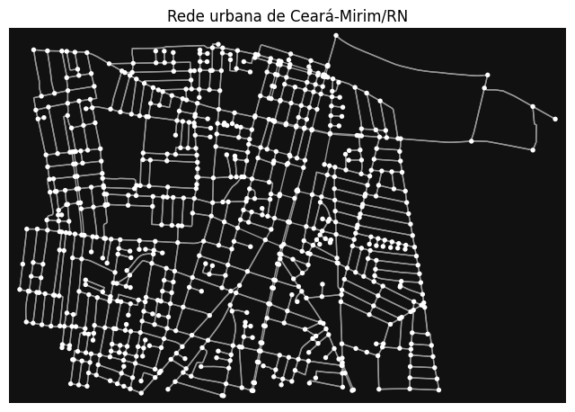

- **Top 10 nós por grau**: Gráfico de barras mostrando os nós com maior número de conexões.
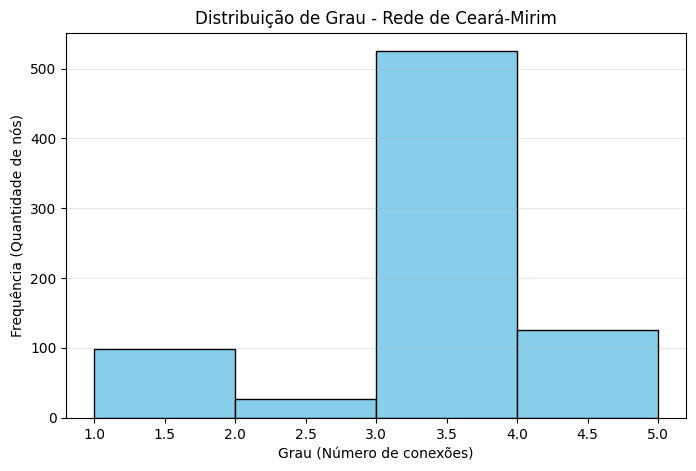

- **Top 10 nós por betweenness**: Gráfico de barras mostrando os nós mais críticos para a conectividade da rede.
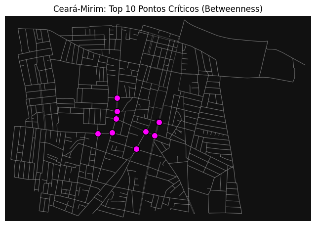

- **Mapa de calor de betweenness**: Visualização geográfica destacando os nós com maior betweenness.
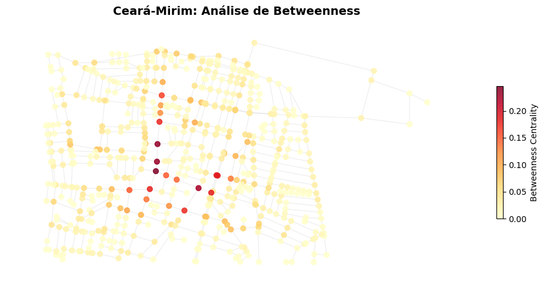

- **K-core principal**: Visualização do núcleo da rede identificado pelo k-core.
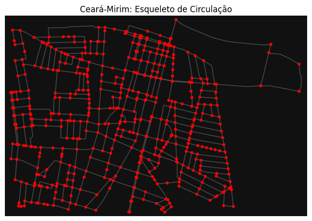

## Principais visualizações (Gephi)
- **Geo Layout**: Visualização da rede em sua posição geográfica real, destacando os nós e suas conexões.
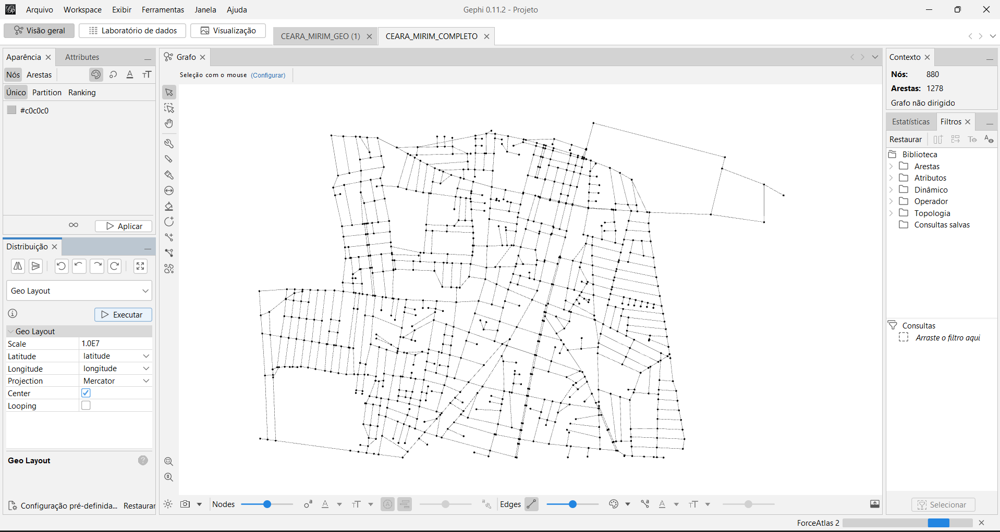

- **Force Atlas 2**: Visualização da rede utilizando um layout estrutural, onde a posição dos nós representa suas relações topológicas.
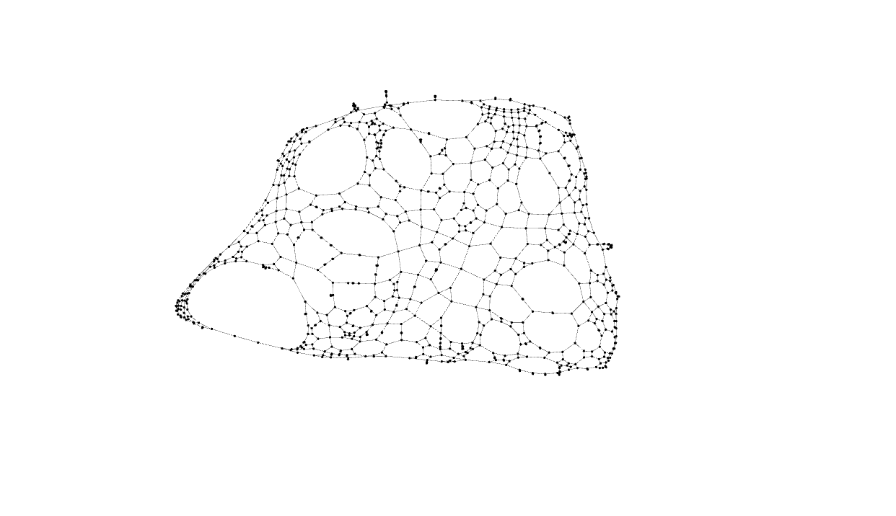

- **Filtro K-core**: Visualização do núcleo da rede identificado pelo k-core, destacando os nós que pertencem ao núcleo.
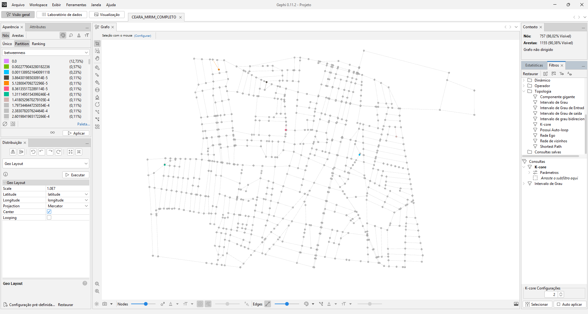

- **Filtro intervalo de graus**: Visualização dos nós com grau entre 3 e 4, destacando os hubs da rede.
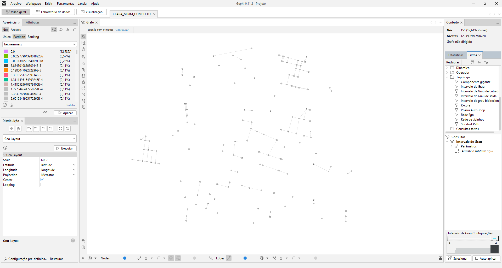

- **Betweenness**: Visualização dos nós com betweenness entre 0.01 e 0.05, destacando os pontos críticos da rede.
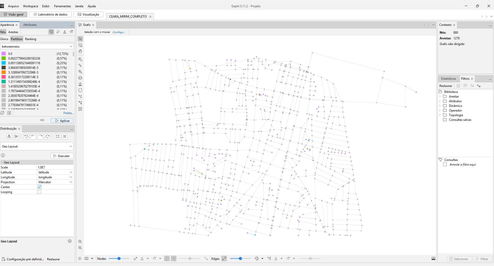

-**Core Number**: Visualização dos nós com core number entre 1 e 2, destacando os nós que pertencem ao núcleo da rede.
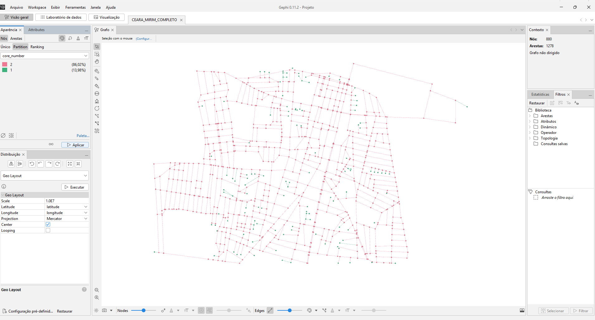

## Questionamentos relevantes da análise:
- **Os nós com maior grau coincidem com os nós de maior betweenness?**
    
    Na rede viária, os nós com maior grau (número de conexões) nem sempre coincidem com os nós de maior betweenness (nós que atuam como pontes entre diferentes partes da rede). Isso ocorre porque um nó pode ter muitas conexões locais, mas não ser crucial para a conectividade global da rede. Por outro lado, um nó com menos conexões pode ser essencial para conectar diferentes regiões, resultando em alta betweenness.

- **O núcleo identificado pelo k-core coincide com os principais hubs?**
    
    Coincide, mas por ser uma região central de uma cidade pequena (k-core maior igual a 2), o núcleo é relativamente pequeno e coincide com os principais hubs, que são os nós mais conectados. No entanto, em redes maiores e mais complexas, o núcleo pode incluir nós que não são necessariamente hubs, mas que são importantes para a estrutura geral da rede.

- **O que a métrica de betweenness revela que o grau não revela?**
    A métrica de betweenness revela a importância de um nó para a conectividade global da rede, indicando quais nós atuam como pontes entre diferentes partes da rede. O grau, por outro lado, apenas indica o número de conexões locais de um nó, sem considerar sua posição na estrutura geral da rede. Portanto, um nó com alto grau pode não ser tão crucial para a conectividade global quanto um nó com alta betweenness. Como temos uma rede pequena, os nós com maior grau (4) se repetem em vários pontos, mas poucos tem alto betweenness.

    Podemos ver ainda, que na tabela que destaca os nós com maior betweenness (imagem abaixo), alguns que possuem grau 3, indicando que mesmo com menos conexões locais, eles são cruciais para a conectividade global da rede.

    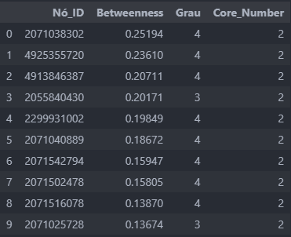

- **O que muda quando a rede é analisada em sua posição geográfica real e quando é analisada por um layout estrutural?**
    Quando a rede é analisada em sua posição geográfica real, a interpretação está relacionada ao espaço urbano físico (forma da cidade, e localização dos bairros...), já no layout estrutural, a posição dos nós deixa de representar localização física e passa a representar relações topológicas da rede.

- **Existem regiões críticas para mobilidade urbana na área analisada?**
        
    Sim. A análise revelou que existem regiões críticas para a mobilidade urbana, especialmente em áreas onde há maior concentração de vias e interseções, como o centro da cidade. Esses pontos críticos são identificados por nós com alta betweenness, indicando que eles atuam como pontes entre diferentes partes da rede.

- **A rede parece homogênea ou apresenta concentração estrutural?**
    
    A rede apresenta uma concentração estrutural, com alguns nós atuando como hubs e outros nós com alta betweenness que são críticos para a conectividade da rede. A presença de hubs indica que existem áreas com maior conectividade, enquanto a presença de nós com alta betweenness sugere que existem pontos críticos para a mobilidade urbana.

- **Os resultados obtidos fazem sentido considerando o conhecimento urbano da região escolhida?**
    
    Sim. Com base na nossa experiência pessoal e conhecimento da região, os resultados obtidos fazem sentido. Os nós identificados como hubs e com alta betweenness correspondem a áreas centrais e de maior fluxo de tráfego, o que é consistente com a estrutura urbana do centro de Ceará-Mirim. A análise geográfica também revelou que as áreas críticas para mobilidade urbana estão localizadas em pontos estratégicos da cidade, onde há maior concentração de vias e interseções. 
    Entendemos também que a rua principal da cidade, que é a General João Varela, por ser duplicada, aparece no grafo com 2 nós por cruzamento, o que pode ter influenciado a análise de centralidade, mas ainda assim os resultados obtidos são coerentes com a realidade urbana da região.

## Conclusão

A análise estrutural da rede urbana do centro de Ceará-Mirim revelou insights importantes sobre a conectividade e os pontos críticos da malha viária. A identificação de hubs, nós com alta betweenness e o núcleo da rede através do k-core permitiu compreender melhor a estrutura da rede e suas implicações para a mobilidade urbana. Os resultados obtidos são consistentes com o conhecimento urbano da região, destacando áreas centrais e pontos críticos para a mobilidade. Este estudo demonstra a importância de aplicar conceitos avançados de estrutura de dados para analisar redes urbanas e contribuir para o planejamento urbano e a melhoria da mobilidade.

## Autores

- [Lucas Augusto da Silva Cardoso](https://github.com/lucasadasc)
- [Pedro Henrique Ribeiro de Lima](https://github.com/pedenrique3)
